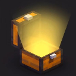

# KitLoader



Save your entire inventory - hotbar, armor and offhand - as named kits with `/kit save`, and restore them any time with `/kit load`. Kits are stored per player, survive across Minecraft versions, and load back into their exact original slots.

A Fabric mod for Minecraft 1.21.11, 26.1, 26.1.1, 26.1.2 and 26.2.

## Features

- **`/kit save <name>`** - store your current inventory as a named kit
- **`/kit load <name>`** - restore a kit, completely overriding the current inventory (main, armor and offhand)
- **`/kit load <Tab>`** - see your saved kits with tab-completion while typing
- **`/kit load`** - list all of your saved kits
- Kits are stored per player and survive across Minecraft versions and game sessions
- Items load back into their exact original slots
- A single unreadable item (e.g. after a data format change) never invalidates a kit - it is skipped with a warning

## Installation

1. Install [Fabric Loader](https://fabricmc.net/use/installer/) 0.19.3+ for your Minecraft version
2. Install [Fabric API](https://modrinth.com/mod/fabric-api)
3. Drop the jar matching your Minecraft version into `.minecraft/mods/` (or the server's `mods/` folder for servers)

Requires Java 25+.

## Downloads

Grab the latest jars from the [Releases](https://github.com/AstroLegendOP/Kitloader/releases) page:

| Minecraft | File |
|---|---|
| 1.21.11 | `kitloader-1.0.0-1.21.11.jar` |
| 26.1 | `kitloader-1.0.0-26.1.jar` |
| 26.1.1 | `kitloader-1.0.0-26.1.1.jar` |
| 26.1.2 | `kitloader-1.0.0-26.1.2.jar` |
| 26.2 | `kitloader-1.0.0-26.2.jar` |

## Building from source

Requires a JDK 25 and an internet connection.

```bash
./gradlew build        # builds the default version (26.2)
./build-all.sh         # builds jars for all five supported versions into dist/
```

## Where kits are stored

Kits are saved as JSON under the config folder:

```
config/kitloader/kits/<player-uuid>/<kit-name>.json
```

## License

MIT
